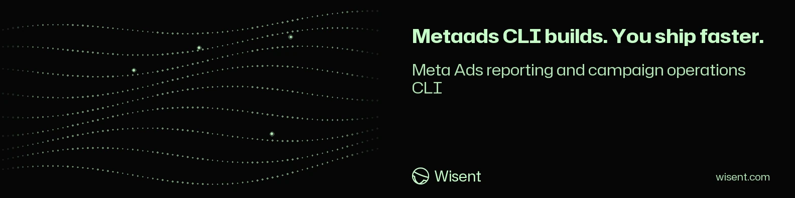

<!-- wisent-banner:start -->
<p align="center">
  
</p>
<!-- wisent-banner:end -->

<!-- wisent-readme-signals:start -->
[](https://github.com/wisent-ai/metaads-cli) [](https://github.com/wisent-ai/metaads-cli/issues) [](https://wisent.com) [](https://discord.gg/qRjpkthq54) [](https://www.linkedin.com/company/wisent-ai/) [](https://x.com/wisentai) [](https://calendly.com/lbartoszcze)
<!-- wisent-readme-signals:end -->

# Meta Ads CLI

[](https://github.com/wisent-ai/metaads-cli/releases)
[](https://github.com/wisent-ai/metaads-cli/releases)
[](https://github.com/wisent-ai/metaads-cli)
[](https://discord.gg/qRjpkthq54)

**Meta Ads CLI is a small Meta Marketing API client for ad-account discovery, campaign inventory, and dated campaign-level performance reporting.**

The command line reads its token from the environment; the JavaScript API accepts an injected `fetch` implementation and returns normalized account, campaign, and insight records.

## Included

- accessible Meta ad accounts;
- campaign inventory and delivery status;
- daily impressions, reach, clicks, spend, actions, and action values;
- normalized account IDs, currencies, statuses, and campaign records;
- pagination across Graph API collection responses.

## Explicit non-goals

- The CLI does not mint OAuth tokens, store long-lived tokens, choose budgets, or publish campaigns automatically.
- API access does not imply permission to mutate an advertiser account.
- Meta action arrays require product-specific attribution interpretation; the library preserves them rather than inventing one conversion total.
- Reported values must be reconciled with first-party conversion and revenue systems.

## Quick start

Requires Node.js 20 or newer and a Meta access token authorized for the requested ad accounts.

```bash
git clone https://github.com/wisent-ai/metaads-cli.git
cd metaads-cli
export META_ADS_ACCESS_TOKEN='...'
node src/cli.js accounts
node src/cli.js campaigns --account act_123456789
node src/cli.js metrics --account act_123456789 --from 2026-08-01 --to 2026-08-11
```

Override the Graph API version with `META_GRAPH_API_VERSION` when Meta advances the contract.

Library use:

```js
import { createMetaAdsClient, normalizeMetaAdAccount } from '@wisent-ai/metaads-cli'

const metaAds = createMetaAdsClient({ accessToken })
const accounts = await metaAds.listAdAccounts()
```

## Operational model

- **Transport:** official Meta Graph and Marketing APIs over HTTPS.
- **Credentials:** environment variables for the CLI; explicit constructor fields for the library; bearer headers on requests.
- **State:** none.
- **Output:** JSON to stdout or normalized JavaScript records.
- **Cost and mutation:** reporting may consume API quota; this release exposes read operations only.

## Project status and support

- **Maturity:** public development source, version `0.1.0`.
- **Issues:** [wisent-ai/metaads-cli](https://github.com/wisent-ai/metaads-cli/issues).
- **Security:** use private GitHub Security Advisories; never attach tokens, account data, query responses, or customer identifiers to a public issue.
- **License:** Apache License 2.0; see [LICENSE](LICENSE).
